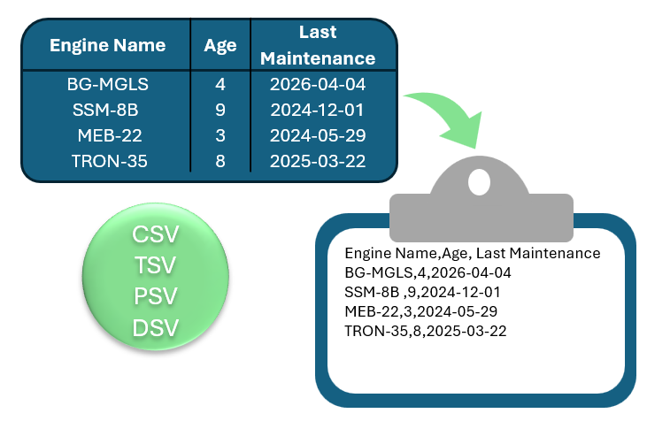
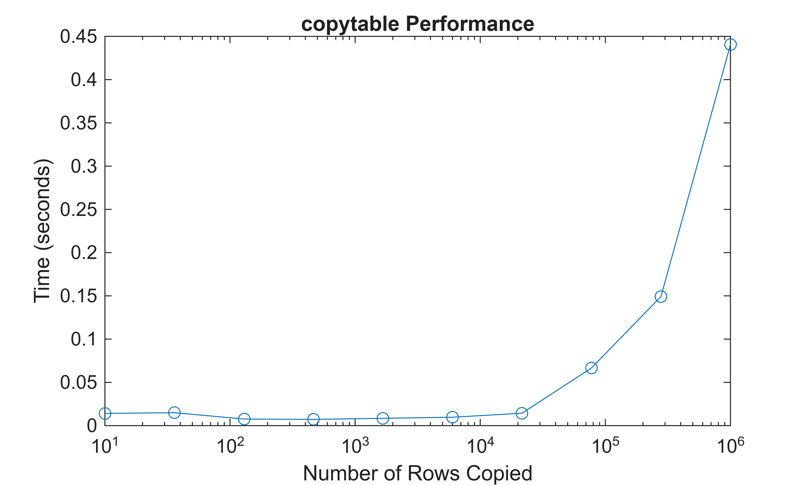

<a id="TMP_7d20"></a>

# copytable
[](https://matlab.mathworks.com/open/github/v1?repo=mathworks/copytable) 

Copy MATLAB® tables to the clipboard for pasting into Excel® or any text\-based application



<!-- Begin Toc -->

## Table of Contents
&#8195;[Background](#TMP_60dd)
 
&#8195;[Features](#TMP_2fd5)
 
&#8195;[Typical Use](#TMP_7b8f)
 
&#8195;[Limitations](#TMP_5ad9)
 
&#8195;[Toolbox Requirements](#TMP_1c93)
 
&#8195;[Compatibility](#TMP_4d35)
 
&#8195;[Example 1 \- use with regular table](#TMP_4307)
 
&#8195;[Example 2 \- use with uitable](#TMP_1d44)
 
&#8195;[Example 3 \- tables with different precision](#TMP_447e)
 
&#8195;[Example 4 \- use with timetable](#TMP_573d)
 
&#8195;[Example 5 \- use with eventtable](#TMP_5360)
 
&#8195;[Example 6 \- applying custom delimiters](#TMP_3de1)
 
&#8195;[Example 7 \- controlling whether table headers are included](#TMP_1c79)
 
&#8195;[Performance](#TMP_2895)
 
<!-- End Toc -->
<a id="TMP_60dd"></a>

# Background

MATLAB provides functions for exporting tabular data to files, but there is currently no built-in way to copy the contents of a table directly to the system clipboard for use in other applications. Saving a table as a temporary file is time consuming when the goal is simply to move results from MATLAB into a spreadsheet, email, or document. 

`copytable` fills that gap by allowing a MATLAB `table`, `timetable`, `eventtable`, or `uitable` to be copied directly to the clipboard in a single command. The resulting text can be pasted into Excel, emails, markdown files, spreadsheets, and other applications without creating temporary files.

Unlike MATLAB's [clipboard](https://www.mathworks.com/help/matlab/ref/clipboard.html) function, `copytable` accepts table\-based data structures directly and automatically formats mixed\-type tabular data for copying and pasting.

This utility is particularly useful for:

- App Designer™ applications that display data in a `uitable`
- Sharing analysis results with colleagues
- Copying data to a markdown file using the | delimiter
- Quickly exporting datasets to Excel
- Exporting tabular data without creating temporary files

<a id="TMP_2fd5"></a>

# Features

The input arguments to copytable are as follows:

1. Required: The table to be copied
2. Optional: The delimiter to be used. Input must be text scalar.
3. Optional: Whether you want to include row headers. Input must be a logical scalar (i.e., `true` or `false`).

Some additional capabilities are:

- Supports the MATLAB `table`, `timetable`, `eventtable`, and `uitable` objects
- Preserves full numeric precision
- Handles mixed data types within the same table
- Automatically generates column headers if included
- Requires no toolboxes beyond MATLAB

Supported scalar data types include:

- Numeric (real and complex)
- Logical
- String
- Character vectors
- Datetime
- Duration
- Calendar duration
- Categorical
- Function handles
- Categorical
- Cell (see limitations)

<a id="TMP_7b8f"></a>

# Typical Use
1. Generate or display table data in MATLAB.
2. Call `copytable` with the table as the input argument with optional arguments for the delimiter type and whether to include headers.
3. Switch to Excel.
4. Paste using **Ctrl+V**.

<a id="TMP_5ad9"></a>

# Limitations
- Each table entry must be scalar. Non\-scalar entries such as vectors, matrices, objects, or multidimensional arrays are not supported.
- Nested tables and other complex container objects such as cells are not supported.
- Cells containing nonscalar values cannot be copied.
- Row names are not copied.
- Variable units are not copied.

For example:

```matlab
unsupportedTable = table([1 2;3 4]);
try
    copytable(unsupportedTable) %this should error as variables are not scalar
catch ME
    disp(ME.identifier)
end
```

```matlabTextOutput
copytable:InvalidTableSize
```

<a id="TMP_1c93"></a>

# Toolbox Requirements
- MATLAB

<a id="TMP_4d35"></a>

# Compatibility

R2024a through R2026a. Untested in earlier versions.

<a id="TMP_4307"></a>

# Example 1 \- use with regular table
```matlab
LastName = ["Sanchez";"Johnson";"Li";"Diaz";"Brown"];
Age = [38;43;38;40;49];
Smoker = logical([1;0;1;0;1]);
Height = [71;69;64;67;64];
Weight = [176;163;131;133;119];
T = table(LastName,Age,Smoker,Height,Weight);
disp(T)
```

```matlabTextOutput
    LastName     Age    Smoker    Height    Weight
    _________    ___    ______    ______    ______

    "Sanchez"    38     true        71       176  
    "Johnson"    43     false       69       163  
    "Li"         38     true        64       131  
    "Diaz"       40     false       67       133  
    "Brown"      49     true        64       119  
```

```matlab
copytable(T)
clipboard('paste') %or paste in Excel
```

```matlabTextOutput
ans = 
    'LastName,Age,Smoker,Height,Weight
     Sanchez,38,true,71,176
     Johnson,43,false,69,163
     Li,38,true,64,131
     Diaz,40,false,67,133
     Brown,49,true,64,119'
```

<a id="TMP_1d44"></a>

# Example 2 \- use with uitable
```matlab
dataCell = {'John', 25, 68.5; 'Sarah', 30, 72.0};
fig = uifigure;
uit = uitable(fig,'Data', dataCell, 'ColumnName', {'Name', 'Age', 'Weight'});
pause(1) %ensure figure and uitable load
copytable(uit)
delete(fig)
clipboard('paste') %or paste in Excel
```

```matlabTextOutput
ans = 
    'Name,Age,Weight
     John,25,68.5
     Sarah,30,72'
```

<a id="TMP_447e"></a>

# Example 3 \- tables with different precision
```matlab
defaultPi = pi*[1;2;3];
piInt = int8(defaultPi);
piHalf = half(defaultPi);
piSingle = single(defaultPi);
piDouble = double(defaultPi)*1;
piFormulas = {@(circ,diam)circ/diam; @(A,r) 2*A/r^2; @(V,r) V/r^3*9/4};
piTable = table(piInt,piHalf,piSingle,piDouble,piFormulas);
disp(piTable)
```

```matlabTextOutput
    piInt    piHalf    piSingle    piDouble          piFormulas       
    _____    ______    ________    ________    _______________________

      3      3.1406     3.1416      3.1416     {@(circ,diam)circ/diam}
      6      6.2812     6.2832      6.2832     {        @(A,r)2*A/r^2}
      9      9.4219     9.4248      9.4248     {      @(V,r)V/r^3*9/4}
```

```matlab
copytable(piTable)
clipboard('paste') %or paste in Excel
```

```matlabTextOutput
ans = 
    'piInt,piHalf,piSingle,piDouble,piFormulas
     3,3.1406,3.1415927,3.141592653589793,"@(circ,diam)circ/diam"
     6,6.2812,6.2831855,6.283185307179586,"@(A,r)2*A/r^2"
     9,9.4219,9.424778,9.424777960769379,"@(V,r)V/r^3*9/4"'
```

<a id="TMP_573d"></a>

# Example 4 \- use with timetable
```matlab
MeasurementTime = datetime(["2015-12-18 08:03:05";"2015-12-18 10:03:17";"2015-12-18 12:03:13"]);
Temp = [37.3;39.1;42.3];
Pressure = [30.1;30.03;29.9];
WindSpeed = [13.4;6.5;7.3];
TT = timetable(MeasurementTime,Temp,Pressure,WindSpeed);
disp(TT)
```

```matlabTextOutput
      MeasurementTime       Temp    Pressure    WindSpeed
    ____________________    ____    ________    _________

    18-Dec-2015 08:03:05    37.3      30.1        13.4   
    18-Dec-2015 10:03:17    39.1     30.03         6.5   
    18-Dec-2015 12:03:13    42.3      29.9         7.3   
```

```matlab
copytable(TT)
clipboard('paste') %or paste in Excel
```

```matlabTextOutput
ans = 
    'MeasurementTime,Temp,Pressure,WindSpeed
     18-Dec-2015 08:03:05,37.3,30.1,13.4
     18-Dec-2015 10:03:17,39.1,30.03,6.5
     18-Dec-2015 12:03:13,42.3,29.9,7.3'
```

<a id="TMP_5360"></a>

# Example 5 \- use with eventtable
```matlab
Time = datetime(2022,11,[3 5 10 14]);
labels = ["Hail","Rain","Snow","Rain"];
lengths = hours([1.2 36 18 20]);
ET = eventtable(Time,EventLabels=labels,EventLengths=lengths);
disp(ET)
```

```matlabTextOutput
       Time        EventLabels    EventLengths
    ___________    ___________    ____________

    03-Nov-2022      "Hail"          1.2 hr   
    05-Nov-2022      "Rain"           36 hr   
    10-Nov-2022      "Snow"           18 hr   
    14-Nov-2022      "Rain"           20 hr   
```

```matlab
copytable(ET)
clipboard('paste') %or paste in Excel
```

```matlabTextOutput
ans = 
    'Time,EventLabels,EventLengths
     03-Nov-2022,Hail,1.2 hr
     05-Nov-2022,Rain,36 hr
     10-Nov-2022,Snow,18 hr
     14-Nov-2022,Rain,20 hr'
```

<a id="TMP_3de1"></a>

# Example 6 \- applying custom delimiters

Change the delimiter from the default "," to the tab delimiter "\\t".

```matlab
Data = [-10-3i; 3+4i; 30];
rowTimes = (calmonths(1:3))';
tabTable = table(rowTimes, Data);
disp(tabTable)
```

```matlabTextOutput
    rowTimes     Data 
    ________    ______

      1mo       -10-3i
      2mo         3+4i
      3mo        30+0i
```

```matlab
copytable(tabTable,'\t')
clipboard('paste')
```

```matlabTextOutput
ans = 
    'rowTimes    Data
     1mo    -10-3i
     2mo    3+4i
     3mo    30'
```

<a id="TMP_1c79"></a>

# Example 7 \- controlling whether table headers are included

The default value to copy the table header is set to `true`. Set this value to `false` to omit the header. 

```matlab
Mixed = {42; "abc"; datetime(2025,1,1)};
Value = [1;2;3];
T = table(Mixed,Value);
disp(T)
```

```matlabTextOutput
         Mixed         Value
    _______________    _____

    {[         42]}      1  
    {["abc"      ]}      2  
    {[01-Jan-2025]}      3  
```

```matlab
copytable(T,"|",false)
clipboard('paste')
```

```matlabTextOutput
ans = 
    '42|1
     abc|2
     01-Jan-2025|3'
```

<a id="TMP_2895"></a>

# Performance

To get a baseline of performance, use `copytable` on a table containing 1 variable (column) with multiple rows. The runtime performance is proportional to the total number of copied values rather than number of columns or rows. It is faster if the data type being copied is not a cell because the function would need to check each individual cell for correctness which affects runtime performance.

```matlab
numberOfRowsArray = ceil(logspace(1,6,10));
timingVector = zeros(size(numberOfRowsArray));
counter = 1; 
for ii = 1:numel(numberOfRowsArray)
    numberOfRows = numberOfRowsArray(ii);
    dataRow = string(rand(numberOfRows,1));
    tableRow = table(dataRow);
    timingVector(counter) = timeit(@() copytable(tableRow));
    counter = counter + 1;
end
plot(numberOfRowsArray,timingVector,'o-')
xscale log
xlabel('Number of Rows Copied')
ylabel('Time (seconds)')
title('copytable Performance')
```


